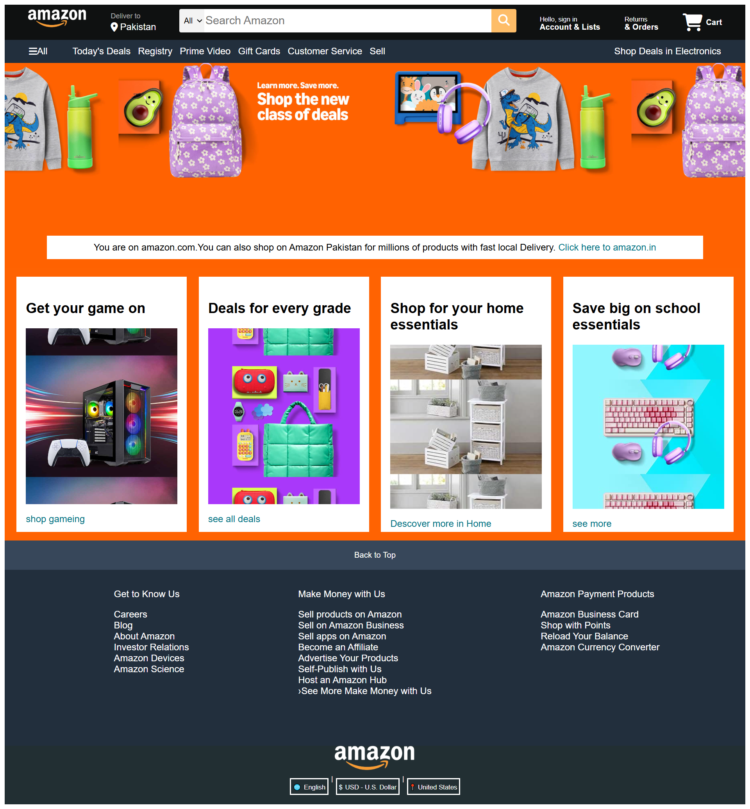

# **Amazon Clone - README**




## **Project Overview**

This is a **static Amazon clone** built with  **HTML and CSS** , replicating key sections of Amazon's homepage, including:

* Navigation bar with search, accounts, and cart
* Product categories and deals
* Footer with links (e.g., "Get to Know Us," "Make Money with Us")
* Language/currency selector

**Live Demo:** [GitHub Pages / Netlify / Vercel Link] *(if deployed)*


## **Features**

✅ **Responsive Design** – Works on desktop and mobile.
✅ **Navigation Bar** – Search bar, account links, and cart.
✅ **Deals & Promotions** – Sections for electronics, home essentials, and school supplies.
✅ **Footer Links** – Organized into columns (e.g., "Get to Know Us," "Make Money with Us").
✅ **Language/Currency Selector** – Mimics Amazon’s dropdown-free selector.


## **Technologies Used**

* **HTML5** – Structure of the webpage.
* **CSS3** – Styling and responsiveness.
* **Flexbox/Grid** – Modern layout techniques.
* **No JavaScript** – Pure frontend (can be extended later).


## **How to Run Locally**

1. **Clone the repository:**
   **sh**

   ```
   https://github.com/MuhammadArshadKhokhar/Web-Development/tree/main/Project
   cd amazon-clone
   ```
2. **Open `index.html` in a browser:**

   * Double-click the file, or
   * Use a live server (e.g., VS Code’s **Live Server** extension).
3. **Customize:**

   * Edit `index.html` and `styles.css` to modify content.

   ## ******Future Improvements******

   🔹 **Add JavaScript** – For a functional cart, search, and dropdowns.
   🔹 **More Pages** – Product details, checkout, and sign-in.
   🔹 **Backend Integration** – Connect to a database (Firebase, Node.js).
   🔹 **Deploy** – Host on Netlify/Vercel for live demo.

## **Credits**

* **Design Reference:** Amazon.com
* **Built by:** [Muhammad Arshad Khokhar]
* **GitHub:** [https://github.com/MuhammadArshadKhokhar]
